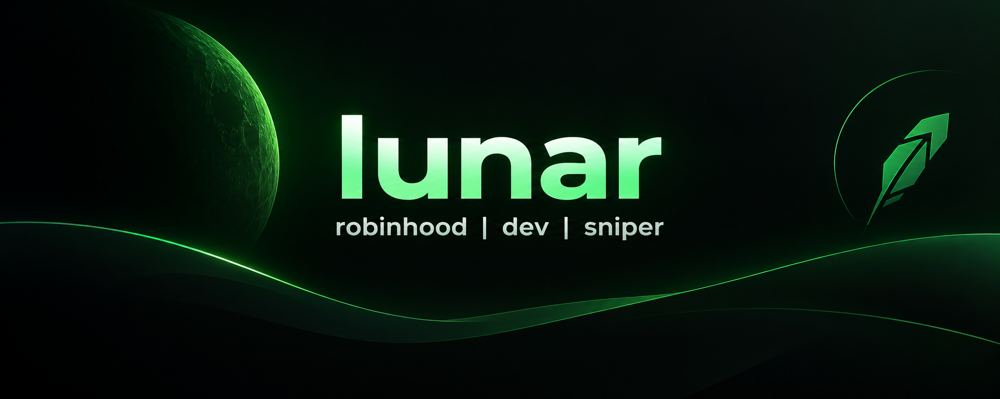
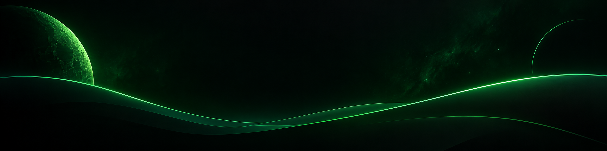

<p align="center">
  
</p>

<h3 align="center">building fast tools, automation & market-focused dev stuff.</h3>

<p align="center">
  
  
  
  <a href="https://x.com/lunarresearcher">
    
  </a>
</p>

---

## 🧠 About Me

```python
developer = {
    "name": "lunar",
    "role": "builder / developer / automation-first operator",
    "focus": [
        "market-focused tooling",
        "automation",
        "snipers & monitoring",
        "fast prototyping",
        "web tools & experiments",
    ],
    "mindset": "ship > talk",
    "status": "always building",
}
```

---

## ⚔️ Experience Snapshot

<p align="center">
  
  
  
</p>

> I build useful things, iterate fast, and optimize for execution.  
> Repositories here reflect experiments, production-minded tooling, automation workflows, and years of hands-on learning by shipping.

---

## 🛠 Stack

<p>
  
  
  
  
  
  
  
</p>

---

## 🎯 What I Work On

| Area | Description |
|---|---|
| 🟢 **Market Tools** | Monitoring, helpers, analytics and execution-focused workflows |
| ⚡ **Snipers** | Fast listeners, alerts and action pipelines |
| 🤖 **Automation** | Scripts, bots and systems that remove repetitive work |
| 🧪 **Experiments** | Small products, APIs, dashboards and technical prototypes |

> Nothing here is static — the repo list changes as I build.

---

## 🧱 Proof of Work

- building & experimenting for years
- public repos, tools and iterations
- focused on execution, not just demos
- rapid prototyping + practical automation
- constant refinement of workflows and systems

---

## 🚀 Featured Projects

### `luna-scan`
Realtime market scanner for tracking movers, unusual volume and ticker momentum with clean terminal and web output.

`Python` `APIs` `Monitoring`

### `hoodflow`
Automation toolkit for market workflows: watchlists, alerts, order prep and execution helpers.

`Python` `Automation` `Data Pipelines`

### `snipewatch`
Low-latency event listener and sniper dashboard for high-signal market events and rapid decision support.

`TypeScript` `Node.js` `WebSockets`

---

## 📊 GitHub Stats

<p align="center">
  
  
</p>

---

## ⚡ Builder Streak

```text
Shipping mindset:     ████████████████████ 100%
Iteration speed:      ██████████████████░░  90%
Automation focus:     ███████████████████░  95%
Execution under load: █████████████████░░░  88%
```

---

<p align="center">
  
</p>
